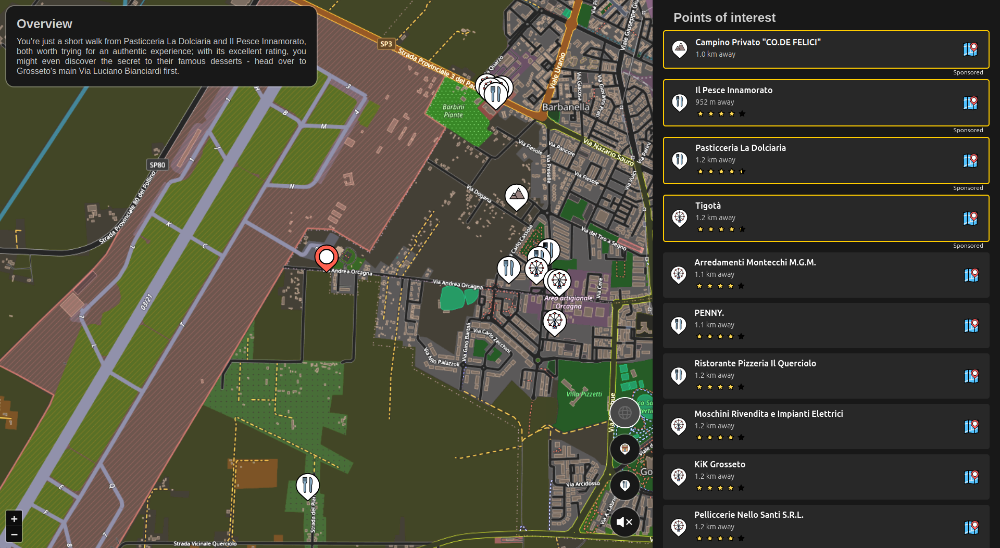

# Travelmate

Travelmate is a web application designed to help you find interesting places to visit based on your current location. It provides a user-friendly interface to explore nearby attractions, restaurants, and other points of interest.
The experience is enhanced by the integration of an AI overview feature that can provide insights and recommendations while you drive with text-to-speech capabilities.

## Screenshot

